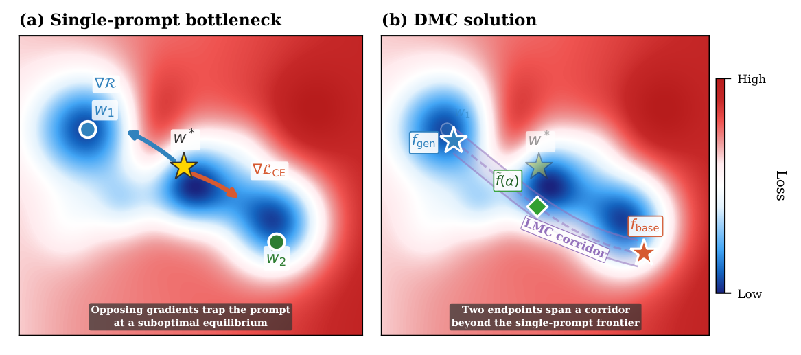

# DMC: Decoupled Mode Connectivity

**Decoupled Mode Connectivity for Base-to-Novel Generalization in Vision-Language Models**
(NeurIPS 2026)

[](https://iemprog.github.io/DMC/)
[](https://iemprog.github.io/DMC/)
[](#citation)
[](#installation)

[Imad Eddine Marouf](https://iemprog.github.io/)<sup>1</sup>, Khalid Oublal<sup>2</sup>,
[Enzo Tartaglione](https://enzotarta.github.io/)<sup>1</sup>,
[Stéphane Lathuilière](https://stelat.eu/)<sup>3</sup>

<sup>1</sup>Télécom Paris, Institut Polytechnique de Paris, France &nbsp; <sup>2</sup>Google DeepMind &nbsp; <sup>3</sup>Inria, Grenoble, France

**Project page:** https://iemprog.github.io/DMC/

---

## TL;DR

- **The problem.** Fine-tuning CLIP's prompt on base classes raises base accuracy
  (69.3 → 82.7 for CoOp, 11-dataset average) but lowers novel accuracy
  (74.2 → 63.2): the harmonic mean does not move.
- **Why better losses don't fix it.** Existing fixes add a regularizer that pulls
  the prompt back toward zero-shot CLIP. With one shared prompt, the
  cross-entropy gradient and the regularizer gradient are antiparallel at
  convergence (measured `ρ = cos(∇L_CE, ∇R) < 0` on all 8 dataset-baseline pairs,
  ≈ −0.95 on Flowers). Seven alternative single-prompt losses gain at most
  +0.40 HM, about what retuning `λ` gives.
- **The idea.** Give each objective its own prompt: `c_spec` specializes,
  `c_gen` stays near zero-shot. Train a linear-mode-connectivity *corridor* in
  text-feature space so every classifier between them has low loss, then deploy
  one point on it (`α = 0.20`). No extra inference cost.
- **When it helps.** Only if the two endpoints stay separated after training
  (`cos(f_gen, f_spec)` = 0.600 for CoOp, 0.719 for KgCoOp). With MMA's small
  adapter they collapse (0.993), and DMC cannot help much.

## Abstract

Prompt learning adapts vision-language models such as CLIP by optimizing a small
set of continuous context vectors. The cross-entropy objective drives the learned
prompt toward base-class specialization, while generalization to unseen classes
benefits from staying close to the zero-shot feature space. Because both
objectives act on the same parameters, their gradients oppose each other at
convergence, and single-prompt losses are confined to a fixed empirical
base-novel trade-off curve across a wide range of loss designs.

We propose **Decoupled Mode Connectivity (DMC)**, which resolves this conflict by
assigning each objective to a dedicated prompt. A linear mode connectivity (LMC)
corridor in text-feature space enforces low classification loss across
interpolated classifiers between the two endpoints. The *Visual Anchor*
regularizer preserves CLIP's pretrained class-similarity structure during
specialization; equivalently, it minimizes the KL divergence between the learned
and pretrained class-similarity distributions. We introduce *class-permutation
invariance* (CPI) as a necessary condition for regularizer transfer across the
base-novel boundary, and prove via Fano's inequality that any CPI violation
lower-bounds the drop in novel accuracy by a term proportional to the mutual
information between the prompt and base-class labels. DMC improves base and novel
accuracy on the majority of dataset-baseline combinations across 11 datasets and
two prompt-tuning baselines (CoOp, KgCoOp), averaged over 3 seeds, shifting the
Pareto frontier rather than trading along it. We further identify the condition
under which the method composes with a given parameter-efficient baseline: the
two endpoints must stay geometrically separated after joint training. The
condition holds for prompt tuning and for text-encoder LoRA, and fails for the
adapter-based MMA, where the endpoints collapse and the corridor degenerates.

---

## Method



**(a)** Under a single shared context, `∇L_CE` (specialize on base classes) and
`∇R` (stay near zero-shot geometry) are antiparallel at any minimum, so the
prompt settles at a Pareto-stationary compromise. Varying the regularizer weight
moves this equilibrium *along* the frontier without leaving it.

**(b)** DMC assigns each objective its own prompt and joins them with an LMC
corridor in text-feature space. The corridor passes through (Base, Novel)
operating points that no single-prompt loss weighting can reach.

### Training objective

Both contexts are initialized from the stage-1 checkpoint `ŵ₂` and optimized
jointly:

```
L_DMC =  L_CE(f_spec) + λ_VA · L_VA        # c_spec only
       + λ_gen · R(f_gen, f_w1)            # c_gen  only
       + β · E_α[ L_CE( f̃(α) ) ]           # LMC corridor, couples both
```

where `f̃(α) = ℓ₂( f_gen + α·(f_spec − f_gen) )`, and

| Term | Meaning |
| --- | --- |
| `c_spec` | **Specialization prompt** — trained by cross-entropy on base classes, free of any pull toward zero-shot features |
| `c_gen` | **Generalization prompt** — trained by the cosine regularizer `R` to recover zero-shot geometry; kept learnable rather than fixed to `f_w1` |
| `R(f, f_w1)` | `1 − (1/C)·Σ_c cos(f_c, f_w1,c)` — isotropic cosine anchor to zero-shot CLIP |
| `L_VA` | **Visual Anchor** — KL divergence between the class-similarity distributions induced by `f_w1` and `f_spec` over two augmented views |
| `β` | LMC path weight; the only term coupling the two prompts |

Interpolation happens in **text-feature space**, not prompt-parameter space:
classification scores are `v · f_c`, and since the text encoder is non-linear, a
straight line between contexts does not map to a straight line between features.

During training `α` is sampled uniformly from `[0, 1]` at every step. At
inference a single fixed `α = 0.20` selects one point on the corridor, so
`f̃(α)` is computed once per dataset and per-image cost is identical to a
single-prompt method.

---

## Results

Over the single-prompt MergeTune stage, DMC raises average HM by **+0.78**
(CoOp) and **+0.33** (KgCoOp), improving on 8/10 and 7/10 non-ImageNet datasets
respectively; the few drops (at most 0.93 HM) are within seed spread. On MMA
the two endpoints collapse (`cos(f_gen, f_spec) = 0.993`), so the corridor
degenerates: MMA + DMC edges out MMA + MergeTune but both trail the published
MMA. Training-free merging (TIES, DARE) lowers HM for every base method. The
full per-dataset tables are in the paper and on the
[project page](https://iemprog.github.io/DMC/).

---

## Installation

Built on [Dassl.pytorch](https://github.com/KaiyangZhou/Dassl.pytorch) and the
[CoOp](https://github.com/KaiyangZhou/CoOp) codebase.

```bash
git clone https://github.com/IemProg/DMC.git
cd DMC

# 1. Environment
conda create -n dmc python=3.8 -y
conda activate dmc

# 2. PyTorch (match the CUDA version on your machine; see https://pytorch.org)
conda install pytorch torchvision cudatoolkit=11.3 -c pytorch -y

# 3. Dassl (vendored in this repository)
cd Dassl.ProGrad.pytorch
pip install -r requirements.txt
pip install -e .
cd ..

# 4. Remaining dependencies
pip install -r requirements.txt
```

CLIP is vendored under `dmc/clip/`; no separate install is needed.

## Datasets

Follow the [CoOp DATASETS.md](https://github.com/KaiyangZhou/CoOp/blob/main/DATASETS.md)
instructions — this repository uses the same layout and the same few-shot splits.

All 11 benchmarks are supported: ImageNet, Caltech101, OxfordPets, StanfordCars,
Flowers102, Food101, FGVCAircraft, SUN397, DTD, EuroSAT, UCF101.

By default datasets are read from `DATA/` and runs are written to `output/`, both
at the repository root. Point them elsewhere with environment variables:

```bash
export DMC_DATA=/path/to/datasets
export DMC_OUTPUT=/path/to/runs
```

Every script resolves its own paths, so they can be launched from any working
directory.

---

## Usage

DMC is a **stage-2** method: it continues fine-tuning an existing PEFT
checkpoint. Stage 1 trains the baseline; stage 2 trains the decoupled prompt
pair on top of it.

### Quick start — full pipeline

The pipeline scripts run stage 1, MergeTune, DMC and all evaluations for three
seeds, skipping any stage whose output already exists:

```bash
bash dmc/scripts/pipelines/run_coop_pipeline.sh   oxford_flowers
bash dmc/scripts/pipelines/run_kgcoop_pipeline.sh oxford_flowers
bash dmc/scripts/pipelines/run_mma_pipeline.sh    oxford_flowers
```

### Step by step

**Stage 1 — train the baseline** (writes the checkpoint DMC initializes from):

```bash
# CoOp                                    <dataset> <seed>
bash dmc/scripts/coop/base2new_train.sh   oxford_flowers 1

# KgCoOp                                  <dataset> <weight> <seed>
bash dmc/scripts/kgcoop/base2new_train.sh oxford_flowers 8.0 1

# MMA                                     <dataset> <seed> <config>
bash dmc/scripts/mma/base2new_train.sh    oxford_flowers 1 vit_b16_ep50
```

**Stage 2 — train DMC** on top of the stage-1 checkpoint:

```bash
# <dataset> <λ_gen> <β> <λ_VA> <seed> <config> [τ]
bash dmc/scripts/dmc/train.sh oxford_flowers 8.0 4.0 0.5 1 vit_b16_ep100_ctxv1

# all three seeds, with base and novel evaluation
bash dmc/scripts/dmc/run_all_seeds.sh oxford_flowers 8.0 4.0 0.5 vit_b16_ep100_ctxv1
```

**Evaluate** — sweeps `α` over the corridor and reports accuracy at each point:

```bash
# <dataset> <λ_gen> <β> <λ_VA> <seed> <config> <base|new>
bash dmc/scripts/dmc/test.sh oxford_flowers 8.0 4.0 0.5 1 vit_b16_ep100_ctxv1 base
bash dmc/scripts/dmc/test.sh oxford_flowers 8.0 4.0 0.5 1 vit_b16_ep100_ctxv1 new
```

The paper's reported numbers use the fixed `α = 0.20` column of this sweep.

**MergeTune baseline** (single-prompt continued fine-tuning), for comparison:

```bash
bash dmc/scripts/mergetune/coop_train.sh   oxford_flowers 8.0 cosine True 1.0 1 vit_b16_ep100_ctxv1
bash dmc/scripts/mergetune/kgcoop_train.sh oxford_flowers 8.0 1.0 1 vit_b16_ep100_ctxv1
bash dmc/scripts/mergetune/mma_train.sh    oxford_flowers 4.0 vit_b16_ep50 1
```

### Hyperparameters

The paper's settings, fixed across all reported experiments and selected on
Flowers102 + Caltech101 as a development set:

| Symbol | Config key | Value | Role |
| --- | --- | --- | --- |
| `λ_gen` | `TRAINER.COOP.DPP_W_GEN` | `8.0` | cosine anchor on `c_gen` (HM plateaus for ≥ 4) |
| `β` | `TRAINER.COOP.W_LMC` | `4.0` | LMC path weight (lowest cross-seed variance) |
| `λ_VA` | `TRAINER.COOP.VA_W` | `0.5` | Visual Anchor weight |
| `τ` | `TRAINER.COOP.VA_TAU` | `2.0` | Visual Anchor softmax temperature |
| `α` | inference only | `0.20` | operating point on the corridor |
| — | `TRAINER.COOP.DPP` | `True` | enables the decoupled two-prompt architecture |

Learning rate, epochs and batch size follow the MergeTune defaults in
`dmc/configs/trainers/`.

> **Naming note.** In the code and in checkpoint paths, DMC is referred to by its
> internal name **DPP** (decoupled prompt pair). `TRAINER.COOP.DPP=True` is what
> switches the decoupled architecture on.

---

## Repository structure

```
DMC/
├── dmc/
│   ├── train.py                  entry point; extend_cfg() documents every option
│   ├── clip/                     vendored CLIP
│   ├── configs/
│   │   ├── datasets/             one yaml per benchmark
│   │   └── trainers/             per-trainer training configs
│   ├── datasets/                 dataset readers (CoOp few-shot splits)
│   ├── trainers/
│   │   ├── coop.py               stage-1 CoOp
│   │   ├── kgcoop.py             stage-1 KgCoOp
│   │   ├── mma.py                stage-1 MMA adapters
│   │   ├── zsclip.py             zero-shot CLIP (provides f_w1)
│   │   ├── kgcoop_coop_LMC.py    MergeTune + DMC for CoOp / KgCoOp
│   │   ├── mma_LMC.py            MergeTune + DMC for MMA
│   │   └── kgcoop_coop_fisher_LMC.py   Fisher-weighted cosine ablation
│   └── scripts/
│       ├── env.sh                shared path resolution — sourced by every script
│       ├── coop|kgcoop|mma/      stage-1 training and evaluation
│       ├── mergetune/            stage-2 single-prompt baseline
│       ├── dmc/                  stage-2 DMC (train / test / all seeds)
│       ├── pipelines/            end-to-end drivers, 3 seeds
│       └── ablations/            the ablations reported in the paper
├── Dassl.ProGrad.pytorch/        training framework (vendored)
└── assets/
```

## Ablations

`dmc/scripts/ablations/` reproduces the paper's ablation tables:

| Script | What it isolates |
| --- | --- |
| `dmc_no_va_run.sh` | DMC without the Visual Anchor |
| `dmc_no_cosine.sh` | DMC with `λ_gen = 0` — decoupling collapses, both prompts converge |
| `mergetune_no_cosine.sh` | single-prompt MergeTune without `R` |
| `fixed_w1.sh` | replaces the learned `c_gen` with fixed zero-shot features |
| `gen_endpoint.sh` | generalization-endpoint variants |
| `gradient_conflict.sh` | measures `γ = cos(∇L_CE, ∇R)` at convergence |
| `sweep_beta_*.sh` | `β` sweep on the development datasets |
| `sweep_lambda_gen_*.sh` | `λ_gen` sweep on the development datasets |

The single-prompt loss modifications from the appendix — none of which escapes
the single-prompt ceiling — are `single_prompt_va_*`, `zsdd_*`, `kl_path_*`,
`w_schedule_*`, `prompt_ewc_*`, `ttai_test.sh` and `fisher_cosine_*`.

## Citation

```bibtex
@inproceedings{marouf2026dmc,
  title     = {Decoupled Mode Connectivity for Base-to-Novel
               Generalization in Vision-Language Models},
  author    = {Marouf, Imad Eddine and Oublal, Khalid and
               Tartaglione, Enzo and Lathuili{\`e}re, St{\'e}phane},
  booktitle = {Advances in Neural Information Processing Systems (NeurIPS)},
  year      = {2026}
}
```

## Acknowledgments

This code builds on several open-source projects:

- [CLIP](https://github.com/openai/CLIP) (OpenAI)
- [CoOp / CoCoOp](https://github.com/KaiyangZhou/CoOp) (Kaiyang Zhou et al.)
- [KgCoOp](https://github.com/htyao89/KgCoOp) (Hantao Yao et al.)
- [MMA](https://github.com/ZjjConan/VLM-MultiModalAdapter) (Lingxiao Yang et al.)
- [Dassl.pytorch](https://github.com/KaiyangZhou/Dassl.pytorch) (Kaiyang Zhou)
